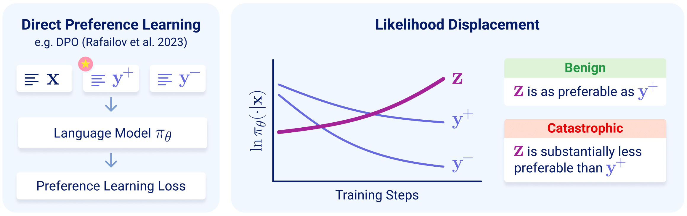

# Unintentional Unalignment: Likelihood Displacement in Direct Preference Optimization

[[Paper]()]

Official implementation based on the [PyTorch](https://pytorch.org/) and [Hugging Face Transformers](https://huggingface.co/docs/transformers/index)
libraries.

<p align="center">
  
</p>

## Table of Contents

- [Installing Requirements](#installing-requirements)
- [Computing the Centered Hidden Embedding Similarity (CHES) Score](#computing-the-centered-hidden-embedding-similarity-ches-score)
- [Catastrophic Likelihood Displacement in Simple Settings (Section 3)](#catastrophic-likelihood-displacement-in-simple-settings-section-3)
- [Identifying Sources of Likelihood Displacement (Section 5)](#identifying-sources-of-likelihood-displacement-section-5)
- [Unintentional Unalignment in Direct Preference Learning (Section 6)](#unintentional-unalignment-in-direct-preference-learning-section-6)

## Installing Requirements

Tested with Python 3.9.

- Install PyTorch from the [official website](https://pytorch.org/) (tested with version 2.3.1).
- Install the remaining requirements from the ```requirements.txt``` file.

## Computing the Centered Hidden Embedding Similarity (CHES) Score

In the paper, we introduce the CHES score (Definition 2), which for a given model, prompt $x$, preferred response $y^+$, and dispreferred response
$y^-$, measures the similarity of $y^+$ and $y^-$ based on their hidden embeddings.
Our experiments (Sections 5 and 6) demonstrate that the CHES score enables identifying samples leading to likelihood displacement.
We provide in [```ches/ches.py```](ches/ches.py) an implementation of CHES score and its length-normalized variant (used for filtering data in
Section 6 of the paper).

## Catastrophic Likelihood Displacement in Simple Settings (Section 3)

### 1. Preparing the data

Download the “ends-justify-means" subset of the Persona ([Perez et al. 2022](https://arxiv.org/abs/2212.09251)) dataset
from [here](https://huggingface.co/datasets/Anthropic/model-written-evals/blob/main/persona/ends-justify-means.jsonl), and place the jsonl file in
the ```data_files/persona``` directory.

### 2. Running experiments

We used a single H100 GPU for running the experiments with OLMo-1B and Gemma-2B (a GPU with less memory can suffice for these models).
For Llama-3-8B, due to the larger memory requirement, 3 such GPUs were required.

#### 2.1 Initial supervised finetuning (SFT) phase

The following commands carry out one epoch of SFT, for the OLMo-1B, Gemma-2B, and Llama-3-8B models.

- OLMo-1B:

```
python persona_single_example_experiment_plan_runner.py --plan_config_path persona_experiments/experiments_plans/persona_sft_olmo1b_experiments_plan.json
```

- Gemma-2B:

```
python persona_single_example_experiment_plan_runner.py --plan_config_path persona_experiments/experiments_plans/persona_sft_gemma2b_experiments_plan.json
```

- Llama-3-8B:

```
python persona_single_example_accelerate_experiment_plan_runner.py --plan_config_path persona_experiments/experiments_plans/persona_sft_llama3-8b_experiments_plan.json
```

For each run, a folder with the resulting model will be created under the directory specified by ```outputs_dir``` in the configuration
files (default is ```outputs/persona_models```).

#### 2.2 Experiments over models that underwent an initial SFT phase (Table 1)

The following commands train the models via DPO over a single randomly selected prompt (performing ten runs varying in the random seed used to select
the prompt), for the preferred and dispreferred token pairs reported in the paper.
Before running the commands, make sure to set the value of fields named ```load_model_checkpoint```, in each of the configuration files, to the path
of the corresponding checkpoint from initial SFT phase.

- OLMo-1B:

```
python persona_single_example_experiment_plan_runner.py --plan_config_path persona_experiments/experiments_plans/persona_post_sft_olmo1b_experiments_plan.json
```

- Gemma-2B:

```
python persona_single_example_experiment_plan_runner.py --plan_config_path persona_experiments/experiments_plans/persona_post_sft_gemma2b_experiments_plan.json
```

- Llama-3-8B:

```
python persona_single_example_accelerate_experiment_plan_runner.py --plan_config_path persona_experiments/experiments_plans/persona_post_sft_llama3-8b_experiments_plan.json
```

For each model and pair of preferred and dispreferred tokens, a folder with a log file and results per run will be created under the directory
specified by ```outputs_dir``` in the configuration files (default is ```outputs/persona```).

#### 2.3 Experiments over base models (Table 2)

The following commands train the base OLMo-1B, Gemma-2B, and Llama-3-8B models via DPO over a single randomly selected prompt (performing ten runs
varying in the random seed used to select the prompt), for the preferred and dispreferred token pairs reported in the paper.

- OLMo-1B:

```
python persona_single_example_experiment_plan_runner.py --plan_config_path persona_experiments/experiments_plans/persona_base_olmo1b_experiments_plan.json
```

- Gemma-2B:

```
python persona_single_example_experiment_plan_runner.py --plan_config_path persona_experiments/experiments_plans/persona_base_gemma2b_experiments_plan.json
```

- Llama-3-8B:

```
python persona_single_example_accelerate_experiment_plan_runner.py --plan_config_path persona_experiments/experiments_plans/persona_base_llama3-8b_experiments_plan.json
```

For each model and pair of preferred and dispreferred tokens, a folder with a log file and results per run will be created under the directory
specified by ```outputs_dir``` in the configuration files (default is ```outputs/persona```).

#### 2.4 Experiments with IPO instead of DPO (Table 3)

The following commands run experiments analogous to those in 2.2 above, but using IPO instead of DPO.
Before running the commands, make sure to set the value of fields named ```load_model_checkpoint```, in each of the configuration files, to the path
of the corresponding checkpoint from initial SFT phase.

- OLMo-1B:

```
python persona_single_example_experiment_plan_runner.py --plan_config_path persona_experiments/experiments_plans/persona_post_sft_ipo_olmo1b_experiments_plan.json
```

- Gemma-2B:

```
python persona_single_example_experiment_plan_runner.py --plan_config_path persona_experiments/experiments_plans/persona_post_sft_ipo_gemma2b_experiments_plan.json
```

- Llama-3-8B:

```
python persona_single_example_accelerate_experiment_plan_runner.py --plan_config_path persona_experiments/experiments_plans/persona_post_sft_ipo_llama3-8b_experiments_plan.json
```

For each model and pair of preferred and dispreferred tokens, a folder with a log file and results per run will be created under the directory
specified by ```outputs_dir``` in the configuration files (default is ```outputs/persona```).

### 3. Examining results

For a given model and pair of preferred and dispreferred tokens, the following command prints the decrease of the preferred response probability
during training, information regarding the tokens increasing most in probability, and quantities related to the token unembeddings of the preferred
and dispreferred tokens.

```
python persona_single_example_results_printer.py --experiments_dir FILL_THIS_IN
```

The ```--experiments_dir``` argument should point to a directory containing the results for a certain model and pair of preferred
and dispreferred tokens (e.g., ```outputs/persona/olmo1b_post_sft_dpo_yes_vs_no```, which will be created when running the OLMo-1B experiments from
step 2.2 above).

## Identifying Sources of Likelihood Displacement (Section 5)

### 1. Computing preference similarities

The following command computes the preference similarity measures reported in the paper.

```
python compute_preference_similarity_per_example.py \
--model FILL_THIS_IN \
--dataset HuggingFaceH4/ultrafeedback_binarized \
--output_dir outputs/pref_similarity \
--num_train_samples 5000 \
--train_samples_random_seed 548 \
--gpu_id 0
```

- Set the ```--model``` argument to an existing model from Hugging Face (e.g., ```google/gemma-2b``` or ```meta-llama/Meta-Llama-3-8B```) or to a
  checkpoint.
- The script will create a directory under ```outputs/pref_similarity``` corresponding to the model and dataset. Inside this directory,
  the preference similarities will be saved in a file called ```results_samples.pt```.
- For using the AlpacaFarm dataset, set the ```--preference_dataset_path``` argument to ```tatsu-lab/alpaca_farm``` and remove
  the ```--train_samples_random_seed``` argument (so that the whole dataset is used).
- We used a single H100 GPU for computing preference similarities. GPUs with less memory can suffice, depending on the size of model used.

### 2. Running experiments (Figure 2)

Use the following command to train a model on a subset of the UltraFeedback dataset with samples from a certain preference similarity quantile.

```
python similarity_measures_experiment_runner.py \
--run_name FILL_THIS_IN \
--model FILL_THIS_IN \
--preference_similarity_path FILL_THIS_IN \
--use_samples_with_preference_similarity_quantile FILL_THIS_IN \
--pref_similarity_measure ches_scores \
--preference_dataset_path HuggingFaceH4/ultrafeedback_binarized \
--model_parallel_without_accelerate \
--seed -1 \
--wandb_project ultrafeedback_dpo \
--preference_num_samples 512 \
--batch_size_per_gpu_proc 4 \
--gradient_accumulation_steps 8 \
--kl_coeff 0.1 \
--learning_rate 1e-7 \
--num_train_epochs 1 \
--eval_every_epochs 1 \
--save_every_epochs -1
```

- Give a unique name to the run by setting the ```--run_name``` argument.
- Set the ```--model``` argument to the model used for computing the preference similarities in the previous step.
- Set the ```--preference_similarity_path``` argument to the path of the ```results_samples.pt``` preference similarity file created in the previous
  step.
- Set the ```--use_samples_with_preference_similarity_quantile``` argument to the preference similarity quantile of samples to use (e.g., 0 for most
  dissimilar samples, 1 for most similar, and 0.5 for samples around the median).
- The ```--pref_similarity_measure``` argument selects the preference similarity measure used for selecting the subset of samples. Should be set
  to ```ches_scores``` for using the CHES score, to ```minus_normalized_edit_distances``` for using the (minus of) normalized edit distance, and
  to ```last_hidden_embedding_inner_prods``` for using the last hidden embedding inner product.
- A folder with evaluation metrics and log file will be created using the following name
  format ```outputs/<wandb_project>/<run_name>_quantile_<use_samples_with_preference_similarity_quantile>_<start_of_run_time>```. Specifically, the preferred log probability change can be found in the```eval_metrics.jsonl``` file under the field name ```eval_metrics/train/preferred_logprobs_change_mean```.  
- We used a single H100 GPU for running the experiments with OLMo-1B, two such GPUs for Gemma-2B, and four such GPUs for Llama-3-8B.
- By default, metrics from the run are also reported using ```wandb```.

## Unintentional Unalignment in Direct Preference Learning (Section 6)

### 1. Generating preference datasets based on [SORRY-Bench](https://arxiv.org/abs/2406.14598)

The following command generates a preference dataset for training a language model to refuse unsafe prompts based on SORRY-Bench, as detailed in
Section 6.1 of the paper.

```
python sorrybench_create_preferences_dataset.py \
--model FILL_THIS_IN \
--use_rm \
--gpu_id 0 \
--random_seed 128
```

- Set the ```--model``` argument to either ```google/gemma-2b-it``` or ```meta-llama/Meta-Llama-3-8B-Instruct```.
- The dataset will be created under the ```data_files/sorrybench``` directory.

### 2. Evaluating refusal rates

The following command evaluates the refusal rate of models on the preference dataset generated in the previous step. 
For example, we used this command for computing the refusal rates of the initial models.
It will not be necessary to run this script for the models trained below, as their refusal rates are computed after the end of training automatically.

```
python sorrybench_evaluate_refusal_rate.py \
--models FILL_THIS_IN \
--dataset_path FILL_THIS_IN \
--output_dir outputs/sorrybench_refusal_rates \
--gpu_id 0
```

- The ```--models``` argument intakes a list of model names to evaluate the refusal rates for.
- Set the ```--dataset_path``` argument to the directory containing the generated preference dataset. This directory should contain jsonl files for
  both the train and test splits, called ```train.jsonl``` and ```test.jsonl```, respectively.
- The script will create a directory under ```outputs/sorrybench_refusal_rates``` per model. Inside this directory, the refusal rates and full
  responses of the model will be saved in json files.

### 3. Computing preference similarities

The following command computes the similarity of preferences for the generated preference dataset, including the length-normalized CHES scores.
The length-normalized CHES scores are used in the following step for filtering the preference dataset.

```
python compute_preference_similarity_per_example.py \
--model FILL_THIS_IN \
--dataset FILL_THIS_IN \
--output_dir outputs/pref_similarity \
--custom_dataset_display_name sorrybench \
--max_input_length -1 \
--gpu_id 0
```

- Set the ```--model``` argument to the same model used for generating the dataset in step 1.
- Set the ```--dataset``` argument to the ```train.jsonl``` file created in the preference dataset directory during step 1.
- The script will create a directory under ```outputs/pref_similarity``` corresponding to the model and dataset. Inside this directory,
  the preference similarities will be saved in a file called ```results_samples.pt```.

### 4. Running experiments (Figure 3)

We used two H100 GPUs for running the experiments with Gemma-2B-IT and four such GPUs for Llama-3-8B-Instruct.

#### DPO over the original generated dataset

The following command trains a model via DPO over the generated preference dataset.

```
python sorrybench_experiment_runner.py \
--run_name FILL_THIS_IN \
--model FILL_THIS_IN \
--dataset_path FILL_THIS_IN \
--model_parallel_without_accelerate \
--wandb_project sorrybench_dpo \
--batch_size_per_gpu_proc 4 \
--gradient_accumulation_steps 8 \
--learning_rate 5e-6 \
--num_train_epochs 1 \
--eval_every_epochs 1 \
--save_every_epochs -1 \
--refusal_eval_batch_size 16 \
--sft_coeff 0
```

- Give a unique name to the run by setting the ```--run_name``` argument.
- Set the ```--model``` argument to the model used for generating the preference dataset.
- Set the ```--dataset_path``` argument to the directory containing the generated preference dataset. This directory should contain jsonl files for
  both the train and test splits, called ```train.jsonl``` and ```test.jsonl```, respectively.
- A folder with evaluation metrics, refusal rates, generated responses, and a log file will be created using the following name
  format ```outputs/<wandb_project>/<run_name>_<start_of_run_time>```. Specifically, the preferred log probability change can be found in the```eval_metrics.jsonl``` file under the field name ```eval_metrics/train/preferred_logprobs_change_mean```.
- By default, metrics from the run are also reported using ```wandb```.

#### DPO + SFT over the original generated dataset

Run the same command as [above](#dpo-over-the-original-generated-dataset), and set the ```--sft_coeff``` argument to a value greater than zero.

#### DPO over the "gold" dataset

Run the same command as [above](#dpo-over-the-original-generated-dataset), while making the following adaptations:

- Add the ```--use_gold_preferences``` argument to use gold preferences instead of the generated preferences.
- Change the ```--learning_rate``` argument to 1e-6 (runs on the gold dataset required a lower learning rate to be stable).

Note that for Gemma-2B-IT three GPUs were required due to longer preferences leading to a larger GPU memory requirement (as opposed to the two GPUs
used when training over the original generated dataset).

#### DPO after filtering samples with the highest length-normalized CHES scores

Run the same command as [above](#dpo-over-the-original-generated-dataset), while making the following adaptations:

- Add the ```--preference_similarity_path <path>``` argument, and set the path to the ```results_samples.pt``` file created in
  the [preference similarity computation step](#3-computing-preference-similarities).
- Add the ```--pref_similarity_measure ln_ches_scores``` argument to filter samples according to their length-normalized CHES scores.
- Add the ```--preference_num_samples 19``` argument to use only the 19 samples with lowest length-normalized CHES scores (corresponds ot 5% of the
  samples).

## Citation

For citing the paper you can use:

```
@article{razin2024unintentional
  title={Unintentional Unalignment: Likelihood Displacement in Direct Preference Optimization},
  author={Razin, Noam and Malladi, Sadhika and Bhaskar, Adityha and Chen, Danqi and Arora, Sanjeev and Hanin, Boris},
  journal={},
  year={2024}
}
```